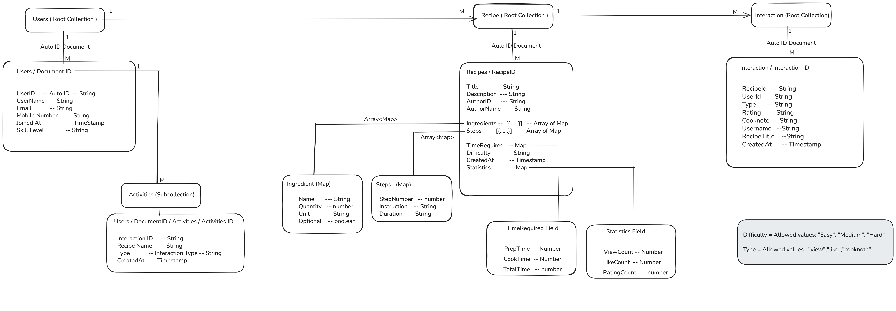
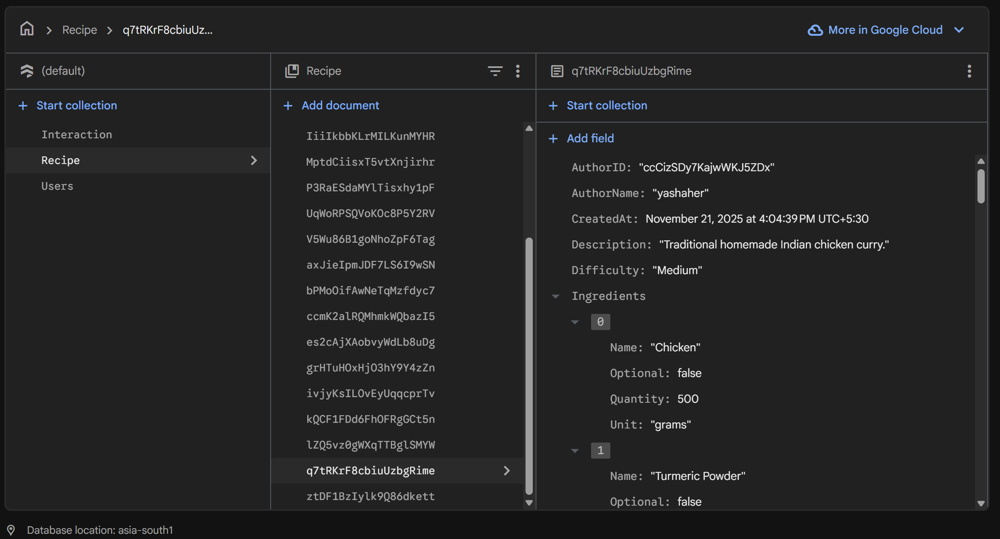
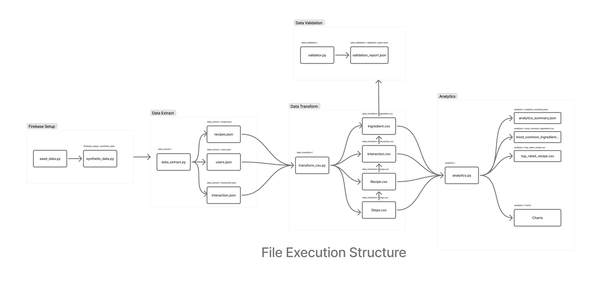
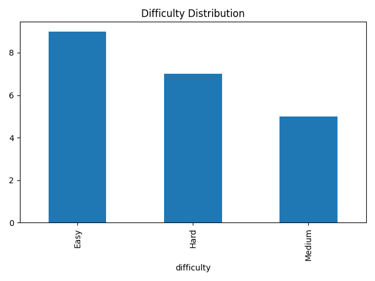
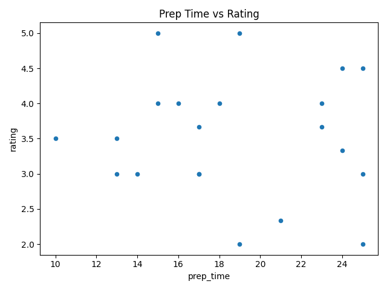
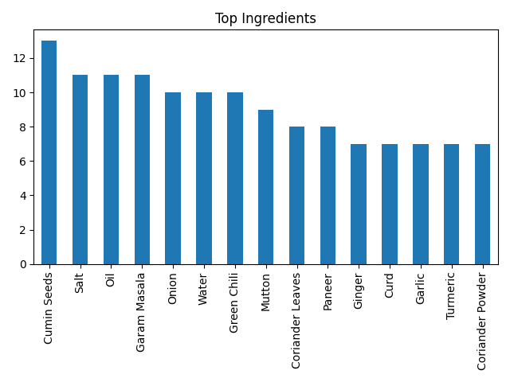

# ETL_Pipeline_Activity_6
This project is a complete data engineering pipeline built on Firebase Firestore. It collects recipe data, exports it, transforms it into clean CSV files, validates the quality of the data, and generates analytics insights.

The pipeline does:
1. Export Firestore collections into JSON
2. Transform the JSON into clean CSV files
3. Validate the transformed data
4. Run analytics to generate insights + charts
5. Store results as CSV, JSON, charts

## 📑 Table of Contents

1. [Project Overview](#etl_pipeline_activity_6)
2. [Core Architecture Highlights](#core-architecture-highlights)
3. [Data Model](#data-model--)
   - [Recipe Collection](#1-recipe-root-collection)
   - [Interaction Collection](#2-interaction-root-collection)
   - [Users Collection](#3-users-root-collection)
   - [Activities Subcollection](#4-activities-subcollection-under-each-user)
4. [How to Run the Pipeline](#how-to-run-the-pipeline--)
5. [Pipeline Outputs](#outputs--)
6. [Firestore Source Data Setup](#firestore-source-data-setup)
7. [ETL Process](#etl-process)
   - [Extract](#e--extract)
   - [Transform](#t--transform)
   - [Load](#l--load)
   - [Validation](#validate)
   - [Analytics](#analyze)
8. [Insights Summary](#insights-summary-example-output)
9. [Known Constraints / Limitations](#known-constraints--limitations)

## Core Architecture Highlights
- **Ingredients and Steps stored as Array of Maps (NOT Subcollections)**\
      &ensp;1. Whole data loads in one single read with the recipe document.\
      &ensp;2. No need for multiple reads like subcollections would require.\
      &ensp;3. Avoids many small documents and reduces read cost.
  
- **Interaction stored as a Separate Root Collection**\
      &ensp;1. Contains recipeId and userId for fast lookup and filtering.\
      &ensp;2. Tracks views, likes, and cook notes cleanly.\
      &ensp;3. Works without joining multiple collections.
  
- **Denormalized Fields (username, recipeTitle) inside Interaction**\
      &ensp;1. Makes UI loading and analytics much faster
  
- **Auto-ID for Recipe, User, and Interaction Documents**\
      &ensp;1. Prevents write hotspotting.
  
- **Activities Subcollection Inside Each User**\
      &ensp;1. Enables per-user queries without scanning large collections
  
- **TimeRequired Stored as a Map**\
      &ensp;1. Prep, Cook, and Total time grouped together\
      &ensp;2. Cleaner structure and easier querying

# **Data Model -**

<!-- 

 -->

The data model consists of three main Firestore root collections and one subcollection:
### 1. Recipe (Root Collection)
  &ensp;Stores all recipes.\
  &ensp;Each recipe keeps title, description, ingredients, steps, time, difficulty, and statistics.\
  &ensp;**Why this design?**\
  &ensp;Ingredients and steps use array of maps, so the whole recipe loads in one read.\
  &ensp;No need for subcollections or multiple reads.

### 2. Interaction (Root Collection)
   &ensp;Stores every user action on any recipe.\
   &ensp;Each document has recipeId, userId, type, rating, cooknote, username, recipeTitle, and createdAt.\
   &ensp;**Why this design?**\
   &ensp;Keeping interactions in a root collection handles large growth easily.\
   &ensp;recipeId + userId makes filtering fast, and denormalized fields avoid extra reads.

### 3. Users (Root Collection)
   &ensp;Stores all user profiles like username, email, joinedAt, and skill level.

### 4. Activities (Subcollection under each User)
   &ensp;Stores actions done by that user across recipes.\
   &ensp;**Why this design?**\
   &ensp;Gives quick access to the user’s personal history without scanning all interactions.

# **How to Run the Pipeline -**

### Prerequisites
> Python 3.9+\
> A service account with Firestore read access (JSON key) when exporting live Firestore data\
> Local environment (or CI runner) with:\
> pip installed\
> Recommended packages in requirements.txt

### Step 1 - Install Dependencies
> pip install firebase-admin pandas matplotlib numpy google-cloud-firestore

### Step 2 — Export Firestore Data
> python firestore_export.py\
> Output → data_extract/recipes.json & users.json

### Step 3 — Transform JSON → CSV
> python transform_to_csv.py\
> Output → recipe.csv, ingredients.csv, steps.csv, interactions.csv

### Step 4 — Validate CSV Data
> python validator.py\
> Output → validation_report.json (lists valid + invalid recipes)

### Step 5 — Run Analytics
> python analytics.py

# **Outputs -**
> Charts → analytics/charts/\
> Summary → analytics/analytics_summary.json\
> CSV → top ingredients, top rated recipes
> Normalized CSVs → data_transform/ \
> Raw JSON extracts → data_extract/ \
> Validation report → data_validation/validation_report.json

  

## **ALTERNATIVE**
## Full Pipeline Runner (run_pipeline.py)
Instead of running each script manually (Extract → Transform → Validate → Analytics),\
you can execute the entire ETL + Analytics pipeline in one command using:
> python run_pipeline.py

The run_pipeline.py file automates all pipeline steps in the correct order:
- Export Firestore data
- Transform JSON → CSV
- Validate CSV data
- Generate analytics & charts
It also prints the status of each step in the console and logs detailed execution messages inside pipeline.log.

# **Firestore Source Data Setup**
 &ensp;**Seed Recipe (Candidate’s Own Recipe)**\
 &ensp; &ensp; &ensp;Chicken Curry (manually inserted into Firestore)\
 &ensp;**Synthetic Recipe Generation**\
 &ensp; &ensp; &ensp;Added 20 synthetic recipes using Python script\
 &ensp; &ensp; &ensp;(Firebase_Setup/synthetic_data_generation/generate_synthetic.py)

# **ETL Process**

## E → Extract
**firestore_export.py\** \
  Reads all Recipes & Interactions\
  Reads all Users\
  Saves as JSON

## T → Transform
**transform_to_csv.py\** \
  Converts JSON to clean CSV tables\
  Converts durations to seconds\
  Fixes missing fields\
  Creates IDs when missing

## L → Load
  Not storing back into Firestore → loading means\
  “prepare for analytics in CSV format”.

## Validate
**validator.py checks:\** \
  Missing fields\
  Invalid difficulty\
  Prep/Cook/Total time logic\
  Non-positive ingredient quantity\
  Rating range (0–5)

## Analyze
**analytics.py creates:\** \
  Most common ingredients\
  Difficulty distribution\
  Correlation between prep time and rating\
  Top rated recipes\
  Recipe step distribution\
  Charts

# **Insights Summary (Example Output)**

### The analytics generates:

- Top 20 most common ingredients
- Average prep time & cook time
- Most interacted recipes
- Top-rated recipes
- Ingredients associated with high ratings
- Correlation between prep time & rating
- Recipes with most comments
- Longest total time recipes

### You can find all results in:
> analytics/analytics_summary.json

# **Known Constraints / Limitations**

### Firestore limitations
  Firestore does not support joins, so some fields are denormalized (username, recipeTitle) inside the Interaction collection.
### Local CSV files must exist
  If export step fails, analytics won’t run.
